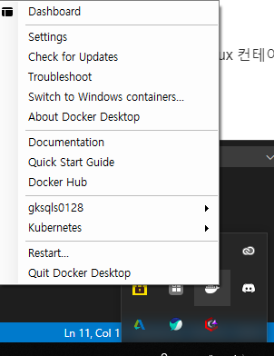
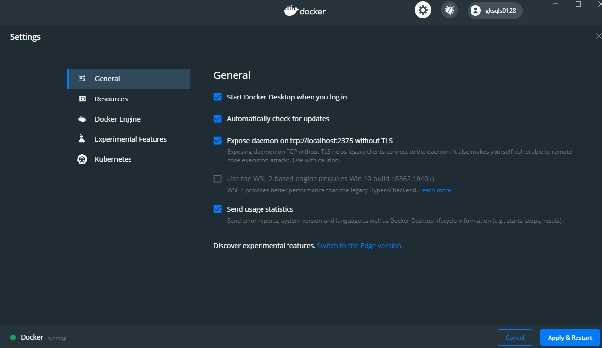

# Docker 컨테이너 만들기 및 사용법

## docker 설치하가
#### Docker for window를 설치하기
[Docker for window](https://hub.docker.com/editions/community/docker-ce-desktop-windows/)
여기서 `Get Docker`버튼을 눌러주자 글구 하라는대로 계속 해주자...
설치가 모두 완료되고 나면,

위와 같이 작업 표시줄에서 우클릭을 하고 `Settings`에 들어가 주자

그리고 `Expose daemon on tcp ...` 를 체크해주고 apply를 해주자.

이러면 이제 기본적인 세팅을 끝났다.

#### 왜 가상환경도 설치했을까?
도커는 기본적으로 `Linux`환경에서만 지원된다. `Windows` 환경에서는 `Hyper-V`를 설치하여 그 위에서 `Docker`가 돌아간다.

## Docker 기본 명령어

#### `docker version`
`docker`의 버전을 확인한다. 