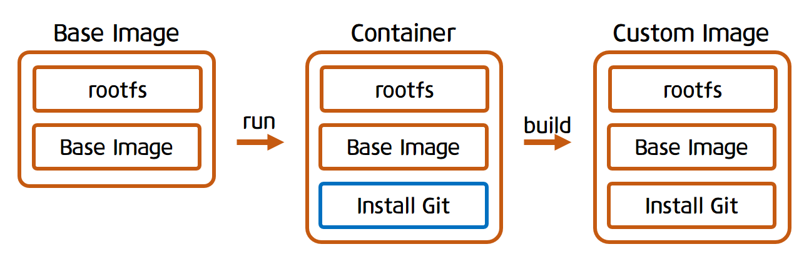

# 도커 이미지 사용법 

## 이미지란?
- 특정 프로세스를 실행시키기 위한 환경
- 계층화된 파일 시스템
- 이미지는 파일들의 집합
- 프로세스가 실행되는 환경도 결국 파일들의 집합

## 이미지 생성 방식

위 그림은 기본 이미지를 컨테이너로 실행시킨 다음에 **Git**을 설치한 후 다시 이미지화 시킨 그림이다.

그럼 기본 이미지를 ubuntu:16.04 라고 생각하고 Git이 설치된 이미지를 생성해보자.
### Git이 설치된 이미지를 만들어보자!
```js
> git run -it ubuntu:16.04 bash 
// ubuntu:16.04 이미지를 실행하며 bash 명령어를 실행했다.
```
```
root@1f0993069f10:~# git
bash: git: command not found
```
위와같이 `git` 명령어를 실행하면 