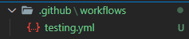

# Github Action 사용법

## Github Action 이란?
- Github 저장소를 기반으로 소프트웨어 개발 workflow를 자동화 할 수 있도록 도와주는 도구 
- ex) Test Code 실행, 자동 배포
  
**※ workflow? 일의 흐름 또는 비즈니스 프로세스**

## push할 때 Test Code 실행하기
프로젝트 root 디렉토리에 `.github\workflows\<파일 이름>.yml` 파일을 만든다.

그리고 안에 아래와 같은 내용을 적어 넣었다.
```yml
name: CI # 이름

on: # Event 감지하는거
  push: # 푸시할때
    branches: [master, develop] # master, develop 브랜치로
  pull_request: # PR할때
    branches: [master, develop] # master, develop 브랜치로

jobs: # 작업 생성
  build: # build 라는 이름의 작업
    runs-on: [ubuntu-latest] # ubuntu로 실행 환경 설정

    strategy: # 어느 버전에서 테스팅 할 지 선택 가능
      matrix:
        node-version: [10.x, 12.x, 14.x] # 이 세가지로 진행하자

    steps: # 명령을 실행하는 개별 작업
      - uses: actions/checkout@v2 # 어떤 액션을 사용할 지 지정
      - name: User Node.js ${{ matrix.node-version }} # 그냥 이름 (버전에 따라 다르게 나오게 했다)
        uses: actions/setup-node@v1
        with:
          node-version: ${{ matrix.node-version }}
      - run: yarn install # 모듈 설치
      - run: yarn jest # 테스트 실행
```

## Django app Github Action Testing
```yml
name: Django CI

on:
  push:
    branches: [ master ]
  pull_request:
    branches: [ master ]

jobs:
  build:

    runs-on: ubuntu-latest
    strategy:
      max-parallel: 4 # 병렬로 실행할 수 있는 작업의 최대 갯수
      matrix:
        python-version: [3.6, 3.7, 3.8]

    steps:
    - uses: actions/checkout@v2
    - name: Set up Python ${{ matrix.python-version }}
      uses: actions/setup-python@v2
      with:
        python-version: ${{ matrix.python-version }}
    - name: Install Dependencies
      run: | # 이 부분을 파일구조에 맞게 나중에 바꿔주도록 하자
        python -m pip install --upgrade pip
        pip install -r requirements.txt 
    - name: Run Tests
      run: | # 이 부분도
        python manage.py test

```

Django Testing 은 위와 같이 구현한다고 한다. 필요할때마다 나한테 맞게 조금씩 바꿔서 써야겠다.