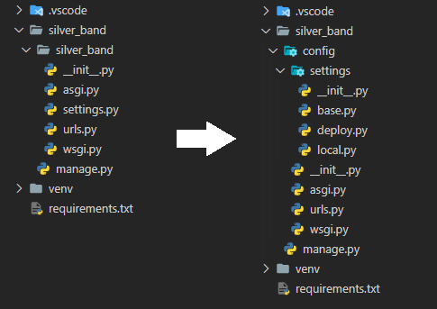

# Django 프로젝트 시작 전 세팅
팀단위의 프로젝트나 소규모 프로젝트를 할때 협업이 편해 장고를 자주 사용하는데, 프로젝트를 시작할때 하는 나의 세팅법을 정리해보고 싶어졌다.

## 1. 폴더 생성 후 가상환경 세팅
```shell
mkdir <프로젝트 이름>
cd <프로젝트 이름>

python -m venv venv
# venv라는 이름의 가상환경 생성

source venv/bin/activate
# source 를 사용해 가상환경을 활성화 시켜준다
```
근데 나는 여기서 `source` 가 가끔 안써진다. 그래서 보통
`Ctrl + Shift + P` 를 눌러 `Python: Select Interpreter` 에서 내가 만든 venv를 선택해준다.

```shell
pip install django, black # black은 python 코드 자동 포맷팅 도구이다.

pip freeze > requirements.txt
```
가상환경을 활성화 시켰다면 기본적으로 사용할 모듈들을 설치해 주고 `requirements.txt`파일을 생성해준다.

**※ 방금 설치한 black 모듈을 사용하여 저장할때마다 코드가 포매팅이 되게 해보자 ※**
방금 가상환경을 활성화 시켰다면 `/.vscode/settings.json` 이라는 파일이 생성 되었을 텐데, 이 두줄을 추가해주자 
```python
# /.vscode/settings.json
{
    "editor.formatOnSave": true,
    "python.formatting.provider": "black"
}
```

## 2. Django 프로젝트 생성 및 구조 변경
```shell
django-admin startproject <프로젝트 이름>
```
을 입력하면 아래와 같은 파일구조가 생성될텐데, 후에 팀원들과 협업과 배포하기 쉽게 구조를 변경해주자

```python
# settings/__init__.py
import os

SETTINGS_MODULE = os.environ.get("DJANGO_SETTINGS_MODULE") 
# 환경 변수에서 DJANGO_SETTINGS_MODULE을 지정해주지 않으면 .local 파일을 임포트 해준다
if not SETTINGS_MODULE or SETTINGS_MODULE == "config.settings":
    from .local import *
```
```python
# settings/local.py and deploy.py
from .base import *
# 이 한줄만 적어주면 base.py의 세팅을 모두 가져온다
```
```python
os.environ.setdefault('DJANGO_SETTINGS_MODULE', '<프로젝트 이름>.settings')
# 을 아래와 같이 바꾸자
os.environ.setdefault('DJANGO_SETTINGS_MODULE', 'config.settings')
```
그리고 설정 앱의 이름을 바꿨기 때문에 `asgi.py` , `wsgi.py` , `manage.py` 에서 위와 같이 바꿔준다.

## 3. secret 파일 생성 및 git 생성
프로젝트를 로컬환경에서만 돌린다면 문제 없겠지만, 후에 배포를 하고 git에 업로드 하게 된다면 DB정보, `SECRET_KEY`, `JWT_SECRET_KEY` 등의 비밀 정보들을 잘 처리해야 한다.
```python
# /.config_secret/settings_common.json

{
    "django": {
        "secret_key": "Q4MRVxzLKE4NjjQytZoAox7mveBKq86o",
        "database": {
            "default": {
                "ENGINE": "django.db.backends.mysql",
                "NAME": "silverbanddb",
                "USER": "root",
                "PASSWORD": "0128gksqls",
                "HOST": "localhost",
                "PORT": "3306"
            }
        }
    },
    "jwt": {
        "secret_key": "Z4Jh4VLjWCQo48p2XAnwTtJFIpIrbUzq",
        "algorithm": "HS256"
    }
}
```
프로젝트의 root 디렉토리에서 `.config_secret` 폴더를 생성하고 `settings_common.json` 파일을 생성해 주고 위와같이 db정보, secret_key를 설정해 준다. 
나는 secret_key를 자동으로 생성해주는 [이 사이트](https://randomkeygen.com/)를 애용한다.

그리고 이제 `base.py`에서 `SECRET_KEY`, `DATABASE`, `JWT_SECRET_KEY` 등을 설정해 주자
```python
import os
import json

# \silver-band=server\silver_band\config
_BASE = os.path.dirname(os.path.dirname(os.path.abspath(__file__)))
# \silver-band=server\silver_band
BASE_DIR = os.path.dirname(_BASE)
# \silver-band=server\silver_band\config
ROOT_DIR = os.path.dirname(BASE_DIR)

CONFIG_SECRET_DIR = os.path.join(ROOT_DIR, ".config_secret")
CONFIG_SECRET_COMMON_FILE = os.path.join(CONFIG_SECRET_DIR, "settings_common.json")

config_secret_common = json.loads(open(CONFIG_SECRET_COMMON_FILE).read())

SECRET_KEY = config_secret_common["django"]["secret_key"]

JWT_AUTH = {
    "JWT_ALLOW_REFRESH": True,
    "JWT_SECRET_KEY": config_secret_common["jwt"]["secret_key"],
    "JWT_ALGORITHM": config_secret_common["jwt"]["algorithm"],
}

DATABASES = config_secret_common["django"]["database"]
```
위와 같이 방금 만든 secret 파일을 적용시켜 주자

모든 과정을 끝냈다면 `git` 설정을 할 차례다
가장 먼저 `git init`을 해주고 `.gitignore` 파일을 생성해준다.

`.gitignore` 파일을 작성해야 하는데, 이럴때 유용한 사이트인 gitignore.io 를 이용하자.
gitignore.io 에서 django를 검색 한 후 그 내용을 복사하여 `.gitignore` 파일에 붙여놓기 해주자.
그리고 방금 만들었던 `.config_secret` 폴더 또한 `.gitignore`에 추가해주자
```python
# .gitignore
...

/.config_secret
```
이제 `github`에 레포지토리를 만들고 `main` 또는 `master` 브랜치에 푸시한 후 기능을 나누며 개발을 시작하자