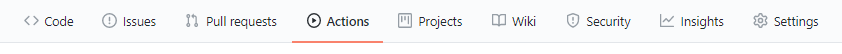
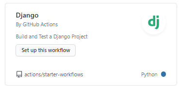
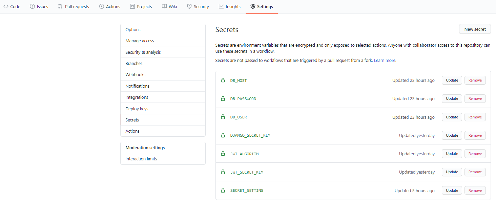

# Django Test 사용법
TDD에 대해 공부하면서 테스트를 작성의 중요함을 알게 되었다. 내가 자주 사용하는 django에서의 테스트 방법을 알아보자

## `tests.py` 파일 작성 및 실행
```python
from django.test import TestCase, Client
from rest_framework import status
from .models import User
import json

client = Client()

class Login(TestCase):
    def setUp(self): # 테스트 전에 동작
        self.credentials = {
            "username": "hanbin",
            "email": "gksqls0128@gmail.com",
            "password": "0128gksqls",
        }
        User.objects.create_user(**self.credentials)

    def tearDown(self): # 테스트 후에 동작 (만든 오브젝트 삭제하기)
        User.objects.all().delete()

    def test_login_success(self): # test_* 형식의 메서드 들은 모두 실행된다.
        response = client.post(
            "/users/auth/login/", self.credentials, content_type="application/json"
        ) # post 방식으로 전송
        self.assertEqual(response.status_code, status.HTTP_200_OK) # status 가 200 이라면 테스트 통과

    def test_login_not_exit_account(self): # 이미 존재하는 계정에 접근 할 때
        fake_credentials = {
            "username": "hanbin",
            "email": "gksqls@gmail.com",
            "password": "0128gksqls",
        } # 일부로 잘못된 credential 준비
        response = client.post(
            "/users/auth/login/", fake_credentials, content_type="application/json"
        )
        self.assertEqual(response.status_code, status.HTTP_400_BAD_REQUEST)
```
이렇게 코드를 작성 한 뒤

`python manage.py test <앱 이름>`을 입력해 준다. 그러면 아래와 같은 메세지를 볼 수 있다.
```
.... # 유닛 테스트 개수
----------------------------------------------------------------------
Ran 4 tests in 13.202s

OK # 테스트 모두 통과
```
이러면 테스트가 통과 된 것이다. 이제 github action과 연동해 보자

## Github Action 연동

가장 먼저 Github의 Action 텝으로 들어가 보자

workflow template을 고르라는 창이 나올텐데



우리는 django를 선택해 준다

그러면 아래와 같은 `yml`이 나올 것이다.
```yml
name: Django CI

on:
  push:
    branches: [ master ] # develop 브랜치도 추가해 주자
  pull_request:
    branches: [ master ] # 여기도!

jobs:
  build:

    runs-on: ubuntu-latest
    strategy:
      max-parallel: 4
      matrix:
        python-version: [3.6, 3.7, 3.8] # 필요한 버전만 냄겨주자

    steps:
    - uses: actions/checkout@v2
    - name: Set up Python ${{ matrix.python-version }}
      uses: actions/setup-python@v2
      with:
        python-version: ${{ matrix.python-version }}
    - name: Install Dependencies
      run: |
        python -m pip install --upgrade pip
        pip install -r requirements.txt
    - name: Run Tests
      run: |
        python manage.py test # 앱 이름을 추가해 주자
        # manage.py의 경로가 다르면 바꿔줘야 한다. (root폴더 기준)
```
여기서 설정을 조금만 만져주면 된다.

이렇게 하고 `start commit`을 눌러주면 자동으로 테스트가 작동할 것이다.
그런데 secret 파일을 `.gitignore`처리를 했다면 Github Action에서 secret 파일을 찾지 못할 것이다.

## Secret Key 설정
우선 Github에 Secret 정보들을 념겨놔야 한다.


위 그림과 같이 Secret 정보를 생성해 주자.

나의 경우에는 아래와 같이 `os`모듈을 사용해서 Secret 파일을 관리했다
```python
# settings.py 또는 base.py

import os
import json

# \silver-band=server\silver_band\config
_BASE = os.path.dirname(os.path.dirname(os.path.abspath(__file__)))
# \silver-band=server\silver_band
BASE_DIR = os.path.dirname(_BASE)
# \silver-band=server\silver_band\config
ROOT_DIR = os.path.dirname(BASE_DIR)

CONFIG_SECRET_DIR = os.path.join(ROOT_DIR, ".config_secret")
CONFIG_SECRET_COMMON_FILE = os.path.join(CONFIG_SECRET_DIR, "settings_common.json")

if os.path.isfile(CONFIG_SECRET_COMMON_FILE):
    # 로컬 환경 또는 배포 환경
    config_secret_common = json.loads(open(CONFIG_SECRET_COMMON_FILE).read())
else:
    # 테스팅 환경 (환경변수로 지정해야댐)
    config_secret_common = json.loads(os.environ["SECRET_SETTING"])

JWT_AUTH = {
    "JWT_ALLOW_REFRESH": True,
    "JWT_SECRET_KEY": config_secret_common["jwt"]["secret_key"],
    "JWT_ALGORITHM": config_secret_common["jwt"]["algorithm"],
}

DATABASES = config_secret_common["django"]["database"]

SECRET_KEY = config_secret_common["django"]["secret_key"]

...
```
위 코드는 만약 `settings_common.json`파일이 없으면 `SECRET_SETTING`라는 이름의 환경변수를 가져온다.

그리고 이제 `workflow/django.yml`에 환경변수를 추가해 주자

```yml
name: Django CI

on:
  push:
    branches: [master, develop]
  pull_request:
    branches: [master, develop]

jobs:
  build:
    runs-on: ubuntu-latest
    strategy:
      max-parallel: 4
      matrix:
        python-version: [3.6, 3.7, 3.8]

    steps:
      - uses: actions/checkout@v2
      - name: Set up Python ${{ matrix.python-version }}
        uses: actions/setup-python@v2
        with:
          python-version: ${{ matrix.python-version }}
      - name: Install Dependencies
        run: |
          python -m pip install --upgrade pip
          pip install -r requirements.txt
      - name: Run Tests
      # ============= 이부분 =============
        env:
          SECRET_SETTING: ${{ secrets.SECRET_SETTING }}
      # =================================
        run: |
          python ./silver_band/manage.py test account

```
위 구문을 추가해 주면 `SECRET_SETTING`라는 이름의 환경변수를 생성해 준다.

이제 다시 test Github Action을 실행해 보면 제대로 굴러가는 것을 볼수 있을 것이다