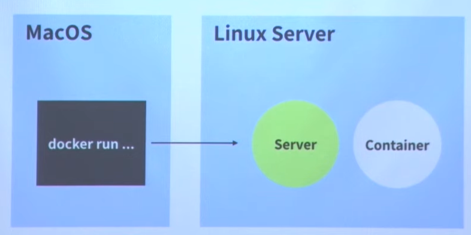

# What is Docker?

Docker는 소프트웨어를 컨테이너라는 표준화 된 유닛으로 패키징하며, 이 컨테이너에는 라이브러리, 시스템 도구, 코드, 런타임 등 소프트웨어를 실행하는 데 필요한 모든 것이 포함되어 있다.

## Docker가 왜 필요한가?
컴퓨터의 환경은 모든 컴퓨터에서 같은 것이 아니다.
특정 OS, 특정 시점의 시스템 설정, 설치된 소프트웨어 등의 여러 요인이 합쳐져 다르게 작동 하기 때문에 서버 관리는 힘들다. 

하지만 도커를 사용한다면 깨끗한 환경(컨테이너)을 제공한다. `Dockerfile`을 작성해 **깨끗한 환경으로 부터 애플리케이션 실행**까지의 최단 경로를 작성한다. 또한, 작동하는 컨테이너를 이미지로 만들면 그 이미지는 **작동하는 상태**라는 보증을 가지게 된다.

이미지를 생성하게 되면 그 이미지를 공유해 다른 사람들과 사용할 수도 있게 된다.

## Docker 주요 개념
### 컨테이너(container)
격리된 공간에서 프로세스가 동작하는 기술이다.
#### **컨테이너는 VM인가?**
1. `VM`은 하드웨어를 가상화 한 것
2. `컨테이너`는 호스트의 프로세스!!

### 이미지(image)
이미지는 컨테이너 실행에 **필요한 파일과 설정 값 등을 포함**하고 있는 것으로 변하지 않는다. **하나의 이미지**로 부터 **여러개의 컨테이너**를 생성할 수 있고 만일 컨테이너가 삭제되더라고 **이미지는 그대로 존재**한다.

## 도커 작동 방식

내가 자주 사용하는 방식으로, `Client`가 `Linux Server`에 있는 `Docker Container`를 조작하는 방식이다.

## Q&A
#### Q. 가상환경은 메모리와 환경을 설정하는데 도커는 시스템 전체를 다 쓸수 있는 것인가?
A. 기본적으로는 시스템 전체를 다 사용한다. 컨테이너를 시작할 때 제약을 줄 수 있다.

#### Q. 실무환경에서는 도커환경에서 리눅스만 한다고 했는데 이유가 무엇인가?
A. 도커를 지원하는 환경이 리눅스기반 밖에 없다.

#### Q. 컨테이너들을 완벽히 분리가 된다고 했는데 보안상에서도 이점을 가지는가?
A. 분리가 된다. 컨테이너를 뚫고 호스트까지 진입하는 방법이면 취약하긴하다. 하지만 기존에 호스트에서 실행하는 방법보다는 더 보안적이다.