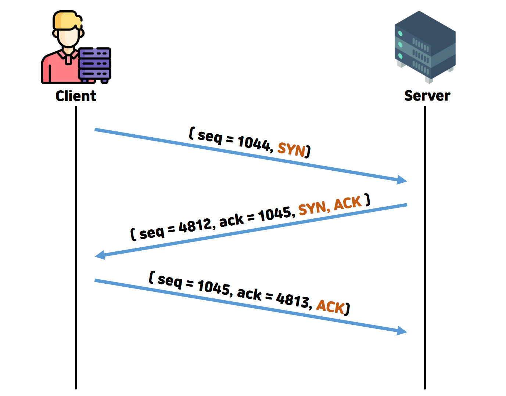

# TCP 3-way handshake란?

TCP는 UDP와 달리 연결 지향 프로토콜이다. 그렇기에 **데이터 전송 전에 세션을 성립**하는 것은 필수적이다. 
3-way handshake란 **데이터 전송 전에 세션을 성립**을 의미하는 것이다.

## 어떻게 동작하지?

1. `Client` **->** `Server` **(SYN)**
   - `Client`가 `Server`로 연결 요청 메세지 **(SYN)** 와 함께 **SYN(a)** 를 보낸다
2. `Server` **->** `Client` **(SYN, ACK)**
   - `Server`가 요청을 수락했다면, `Client`도 포트를 열어달라는 메세지를 전송한다
   - 서버 또한 **SYN(b)** 와 **ACK(a + 1)** 를 보낸다
3. `Client` **->** `Server` **(ACK)**
   - 수락 응답인 **SYN(b)** 와 **ACK(a + 1)** 를 받고 **ACK(b + 1)** 를 보내면 연결이 성립된다
## 이게 왜 필요하지?