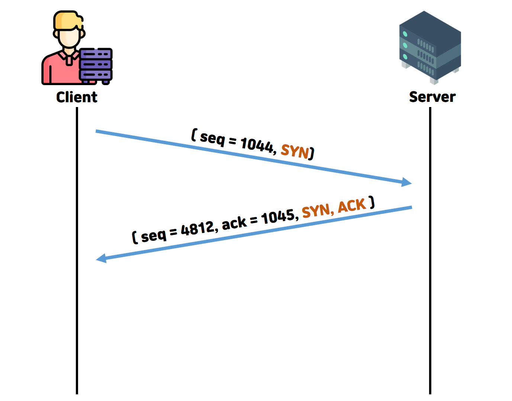

# TCP 3-way handshake란?

TCP는 UDP와 달리 연결 지향 프로토콜이다. 그렇기에 **데이터 전송 전에 세션을 성립**하는 것은 필수적이다. 
3-way handshake란 **데이터 전송 전에 세션을 성립**을 의미하는 것이다.

## 어떻게 동작하지?

> **SYN = Synchronize sequence number**, **ACK = Acknowledgement**
1. `Client` **->** `Server` **(SYN)**
   - `Client`가 `Server`로 연결 요청 메세지 **(SYN)** 와 함께 **SYN(a)** 를 보낸다
2. `Server` **->** `Client` **(SYN, ACK)**
   - `Server`가 요청을 수락했다면, `Client`도 포트를 열어달라는 메세지를 전송한다
   - 서버 또한 **SYN(b)** 와 **ACK(a + 1)** 를 보낸다
3. `Client` **->** `Server` **(ACK)**
   - 수락 응답인 **SYN(b)** 와 **ACK(a + 1)** 를 받고 **ACK(b + 1)** 를 보내면 연결이 성립된다

**※ seq와 ack에 +1을 하는 이유 ※**

`Client` 에서 시작된 `SYN`이 `ACK`와 관련이 있음을 표시하기 위해서

[여기를 참고했다](https://stackoverflow.com/questions/6804979/why-does-tcps-three-way-handshake-bump-the-sequence-number-when-acking)
## 이게 왜 필요하지?
##### 단순히 서로의 존재를 알리기 위해서는 2-way handshake 로도 가능하지 않을까?

- TCP 통신은 양방향성을 띄고 있다. `Client`와 `Server`모두가 존재를 알리고 **패킷을 보내고 받을수 있다는 것**을 알려야 한다.
- 위와 같이 2-way-handshake를 한다면
   1. `Client`는 `Server`에게 연결 요청을 한다
   2. `Server`는 그것에 대한 응답을 해 연결 확립을 한다.
- 만약 `1번` 과정이 오래 전에 했던 응답이라 `Client`는 비가용상태에 돌입했다면, `Server`는 그런줄도 모르고 세션을 확립할 것이다
- 그렇기 때문에 `3번`과정을 추가하여 `Client`가 **"나는 가용상태이다"** 라는 정보을 보내줘야 한다. 
