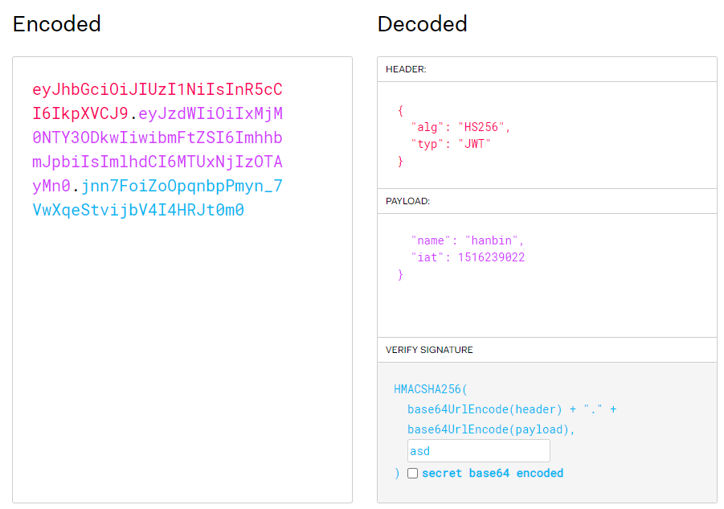

# JWT란 무엇인가?
JWT는 정보를 `JSON`객체 형태로 주고 받기 위해 표준규약에 따라 생성한 암호화된 문자열이다.

## JWT의 특징
[](https://jwt.io/)
위 사진은 [jwt.io](https://jwt.io/) 에서 캡쳐한 사진이다. 위 사진을 보고 몇가지 특징을 알아보자
#### 누구나 정보를 확인할 수 있다.
Base64 디코딩만 하면 누구나 내용을 확인 할 수 있다. 위 `JWT` 문자열은 암호화되어 있었음에도 불구하고 우측의 `payload`에 모든 정보가 표시되어 있는 것을 볼 수 있다.

#### 위변조가 불가능하다.
`JWT`는 누구나 `payload`를 볼 수 있고 바꿀 수도 있는데 왜 위변조가 불가능할까? 

그 이유는 위 사진의 `Verify Signature`를 보면 알 수 있다. `Verify Signature`는 `header`, `payload`, `secret key` 세가지를 이용해 해싱하여 제작한다. 그렇게 때문에 비록 `header`와 `payload`를 알고 있을 지라도 `secret key`가 다르다면 **서버에서 잘못된 토큰임을 검증**해 낼 수 있다.

#### 자가 수용적이다.
JWT는 필요한 정보를 `header`와 `payload`에 담아 자체적으로 지니고 있다. 

## JWT의 구조를 알아보자

### 1. Header
```json
{
    "alg":"HS256",
    "typ":"JWT"
}
```
보이는 것 과 같이 `Signature`를 만드는데 사용된 알고리즘과 방식이 기입되어 있다.

### 2. Payload
```json
{
    "name" : "hanbin",
    "role" : 12,
    "is_active" : true
}
```
`payload`에는 토큰에 담을 정보(claim)을 포함하고 있다. 하나의 `key-value` 쌍을 `claim`이라 부른다.

이 `claim`은 Registered, Public, Private 세가지로 나뉜다.

토큰 자체에 모든 정보를 포함하고 있다는 점 덕분에 다른 인증 방식보다 **높은 효율성**을 가진다.  이부분에 대해서는 아래에서 설명하겠다.
##### Registered (등록된 클레임 이름)
`Registered claim`은 [IANA JSON WEB TOKEN](https://www.iana.org/assignments/jwt/jwt.xhtml) 에서 등록된 이름의 key를 말하는 것이다. 이 클레임을 사용하는 것은 필수는 아니고 선택사항이다.

아래 목록은 등록된 클레임의 일부이다.

- `iat` - 토큰이 등록된 시간
- `exp` - 만료시간
- `iss` - 토큰 발급자
- `aud` - 토큰을 사용할 수신자

##### Public (공개 클레임 이름) 
이름 및 이메일과 같은 일반 정보를 포함한 **사용자 지정 claim** 이다. 사용시에 충돌을 방지하기 위해 URI방식으로 사용한다.
```json
{
  "https://hanbin2.com/users/is_admin" : true
}
```


##### Private (비밀 클레임 이름)
발급자와 수신자 끼리 사용하기 위해 만든 `claim`, 좀 더 구체적인 정보가 주로 들어간다

다음은 `Private claim`의 예시이다.
- `deployee_id`
- `department_id`

### 3. Signature
```js
HMACSHA256(
  base64UrlEncode(header) + "." + base64UrlEncode(payload),
  secret_key
)
```
Signature는 다음과 같이 `base64`로 인코딩 된 `header`, `payload`와 `secret_key`를 해싱하여 제작한다.

## 다른 방식에 비해 어떤 효율성을 가지는가?
토큰 자체에 정보가 들어있는 `JWT`와 달리 다른 방식들은 토큰을 오직 **인증**을 위해서만 사용한다. 그렇기 때문에 인증 후 추가 권한에 대한 정보가 필요하다면 DB에 요청을 보내 확인해야 한다.

하지만 `JWT`는 토큰 자체에 권한, 만료일 등의 정보가 존재하기 떄문에 굳이 DB에 접속하지 않고도 권한을 확인 할 수 있다.

