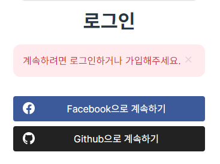

# OAuth (Open Authentication)

프로그래머스에 인증을 하고자 할때, 위와 같은 버튼들이 나온다. 만약 `Facebook으로 계속하기`를 누른다면, 해당 페이스북 로그인 페이지로 이동하게 된다. 그렇게 로그인을 하면 프로그래머스의 API들을 사용할 수 있게 된다.

난 분명 **페이스북 로그인**을 했는데 왜 **프로그래머스의 API**를 사용할 수 있게 된 것일까?

## Auth란?
로그인을 제공하는 **플랫폼(페이스북)의 계정**만 있다면 **외부 서비스(프로그래머스)** 에서도 인증을 가능하게 하여 **API를 사용**할 수 있도록 해주는 프로토콜이다.
그렇기 때문에 페이스북 로그인을 했는데도 프로그래머스의 API 사용할 수 있게 된 것이다.

## 용어 정리
`Resource Owner` : `Resource Server`의 계정을 소유하고 있는 사용자
`Client` : 제 3의 서비스 `ex) 프로그래머스`
`Authorization Server` : Token을 발급, 재발급 해주는 서비스 `ex) 프로그래머스의 로그인 기능`
`Resource Server` : `OAuth` 서비스를 제공하고, 자원을 관리하는 서버 `ex) 구글, 카카오`
