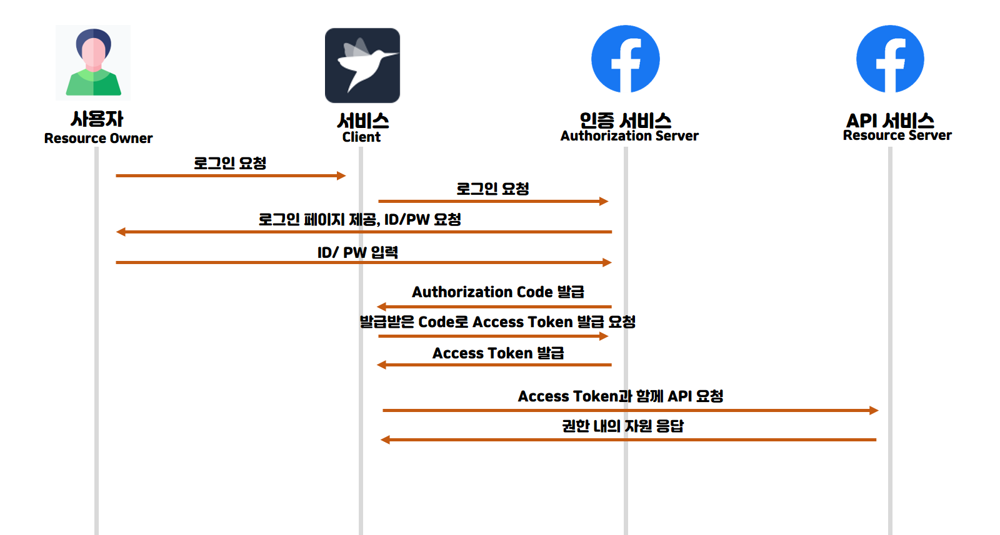

# OAuth (Open Authentication)
이 문서는 `OAuth2`의 `Authorization Code Grant` 에 대해 설명하고 있습니다.

프로그래머스에 인증을 하고자 할때, 위와 같은 버튼들이 나온다. 만약 `Facebook으로 계속하기`를 누른다면, 해당 페이스북 로그인 페이지로 이동하게 된다. 그렇게 로그인을 하면 프로그래머스의 API들을 사용할 수 있게 된다.

난 분명 **페이스북 로그인**을 했는데 왜 **프로그래머스의 API**를 사용할 수 있게 된 것일까?

## OAuth란?
로그인을 제공하는 **플랫폼(페이스북)의 계정**만 있다면 **외부 서비스(프로그래머스)** 에서도 인증을 가능하게 하여 **API를 사용**할 수 있도록 해주는 프로토콜이다.
그렇기 때문에 페이스북 로그인을 했는데도 프로그래머스의 API 사용할 수 있게 된 것이다.

## 용어 정리

`Resource Owner` : `Resource Server`의 계정을 소유하고 있는 사용자 (`User`)

`Client` : 제 3의 서비스 `ex) 프로그래머스, 내가 만들고자 하는 서비스`

`Authorization Server` : Token을 발급, 재발급 해주는 서비스 `ex) 구글 로그인 기능`

`Resource Server` : `OAuth` 서비스를 제공하고, 자원을 관리하는 서버 `ex) 구글, 카카오`

## OAuth 처리 과정

1. 사용자가 `Client`에 로그인 요청을 보내고 `Client`가 `Authorization Server` 에게 로그인 페이지를 요청한다.
2. 사용자가 `Authorization Server`에서 로그인을 마친다면 `Authorization Code`를 발급한다.
3. `Authorization Code`으로 `Access Token`을 발급하기 위해 요청한다.
4. `Access Token`을 발급해준다.
5. 나중에 `Access Token`과 함께 API를 요청하면 `Resource Server`에서 확인하고 응답해준다.