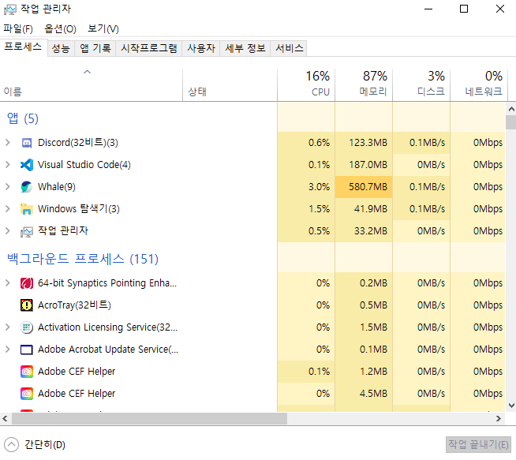

# 프로세스 vs 스레드

이 둘을 정리하기 전에 프로그램이 무엇인지 알아두자.
프로그램은 **"실행가능한 명령어의 집합"** 이다.

프로그램은 스크립트 파일일 수도 있고, 컴파일 된 바이너리 형태일 수도 있다. 즉 내가 짠 파이썬 코드도 프로그램, 디스코드 파일도 프로그램이라 할 수 있다.

프로그램의 정의를 내리자면 

**`파일이 저장 장치에 저장되어 있지만 메모리에는 올라가 있지 않은 정적인 상태`** 라고 할 수 있다

앞서 말한 파이썬 코드와 디스코드 파일은 내 PC에 잘 저장되어 있다. 

하지만 내가 눌러 실행하기 전까지는 그저 **코드 덩어리** 이다.
## 프로세스란?
프로세서는 **메모리에 적재되어 실행되고 있는 프로그램**이라고 정의를 내릴 수 있다.

위 사진은 윈도우 작업관리자를 실행한 화면이다. 
사진을 보면 앞서 말한 디스코드 **프로그램** 이 메모리에 **적재** 되어 **실행중**인 것을 볼수있다.

## 스레드란?
스레드는 프로세스 내에 할당된 메모리, CPU 등의 자원을 사용하는 실행 단위이다.

위 그림과 같이 프로세스의 Code, Data, Heap 영역만 공유하며 Stack 영역은 별도로 할당 받는다.

## Stack, Code, Data, Heap?
#### Stack
Stack 영역은 지역 변수, 호출된 함수들이 쌓이는 공간이다.
#### Code
Code 영역은 프로세스가 실행 할 코드가 컴파일되어 저장되어 있는 공간이다. 중간에 변경할 수 없도록 Read-Only로 지정되어 있다.
#### Data
Data 영역은 전역변수(global), 정적변수(static), 배열(array), 구조체(structure)등이 저장된다.
#### Heap
Heap 영역은 런타임에 크기가 결정되는 메모리 영역이다. Memory pool 이라고 생각하면 된다.
### Ref.
https://www.youtube.com/watch?v=cUKTYA6LUTk
https://covenant.tistory.com/231