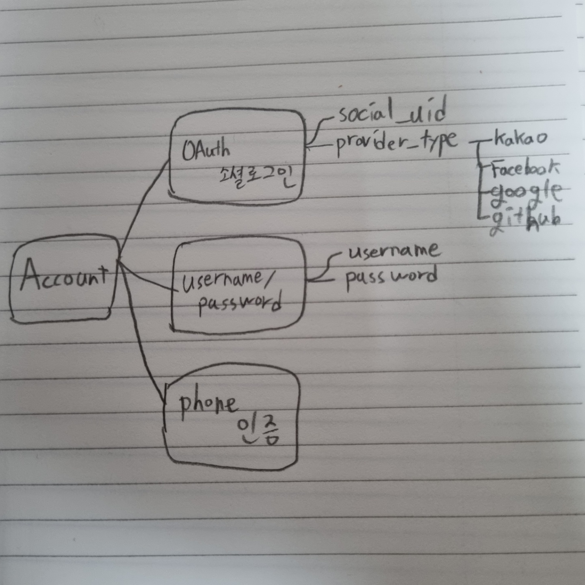

# 로그인

서비스를 구현하다보면 하나의 계정에 여러 로그인 방식을 붙이게 된다.
- username / password
- 소셜 로그인
- 휴대폰 인증

이런 경우 DB 스키마를 어떻게 작성해야 할까?

바로 계정 정보와 로그인 정보를 분리하면 된다.

여기서 말하는 계정정보와 로그인 정보는 다음과 같은 차이점이 있다.
- 계정 정보 : 계정에 대한 정보 `(ex)프로필 url, 닉네임, 이메일 등`
- 로그인 정보 : 로그인을 하기 위한 정보 `(ex) username/password, oauth uid 등`

만약 Account에 계정 정보와 로그인 정보를 함께 포함시킨다면 아래와 같이 username/password 로그인 밖에 사용할 수 없게 된다.

그러나 아래와 같이 Account 에는 계정정보를 담고, 로그인 정보를 담는 테이블을 분리시키면 여러 로그인 기능을 사용할 수 있게 된다.

이제 access token 을 return 하는 `/login`, `/login/oauth`, `/login/by-phone` 등 여러 로그인 엔드포인트를 만들어 다양한 로그인 기능을 구현할 수 있다.